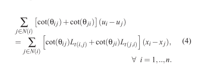
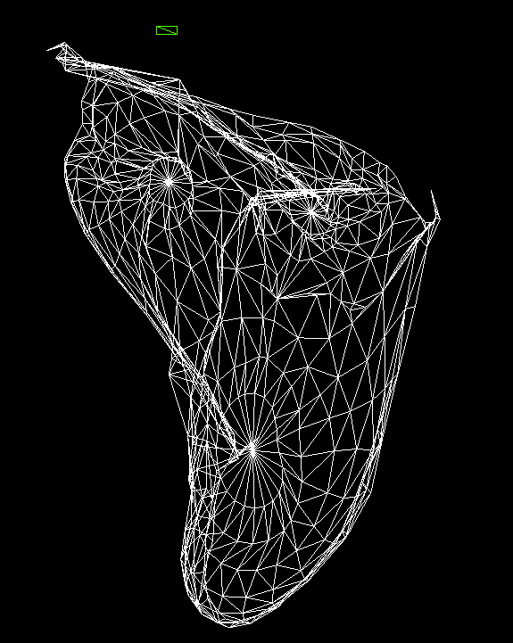

# 作业5 ARAP 和 ASAP 参数化方法

刘紫檀 PB17000232

## 原理

在参数化过程中定义能量 $ E $ 是局域变换 $ L_t $ 和映射的目标位置 $ u $ 的函数：

$$
E(u,L)= \sum A_t \| J_t(u)−L_t\|^2_F
$$
这里 $ u $ 是三个顶点张成的一个量，$ A_t $ 是三角形 $ t $ 的面积，而 $ J_t(u) $ 是这个三角形所对应的 2x2 Jacobian 矩阵。$ L_t $ 是 auxiliary linear transformation，其从一个可能的变换族中取（比如相似变换、旋转变换）。

论文中提到，上式可以写成如下形式：
$$
E(u,L) = \frac{1}{2} \sum^T_{t=1} \sum^2_{i=0} \cot(\theta_t^i) \| (u_t^i - u_t^{i+1}) - L_t (x_t^i - x_t^{i+1}) \|^2 
$$
其中三角形 $ x_t $ 的三个顶点分别写为 $ \{x_t^0, x_t^1, x_t^2\} $ （每个顶点又有两个参数），而 $θ^i_t$ 是 $ x_t $ 这个三角形的 $ (x^i_t ,x^{i+1}_t) $ 边所对的角，并且所有 $ x_t $ 的上标都是模 3 的结果。

> 论文这里应该是写错了（写成了模 2）。

我们需要让能量达到最小值，以得到一个比较好的参数化结果。此时有两种方法：

1. 显式地把方程的导数全部求出，解令导数等于 0 的大型稀疏线性方程组
2. **(local/global 方法)** 一种迭代方法，分为两部分：
   1. (local) 固定 $ u $，对 $ J_t(u) $ 进行 SVD 分解，并且将中间的对角阵进行一些处理，得到新的 $ L_t $
   2. (global) 固定 $ L_t $，利用求极值的方法列稀疏线性方程组求 $ u $

### ASAP 方法（显式法求解）

在 ASAP 方法中，我们选择相似变换族（$ \forall {\bf v_i, v_j, v_k, v_l}, \large\frac{\|f({\bf v_i}) - f({\bf v_k})\|}{\|f({\bf v_j}) - f({\bf v_l})\|} = k $，相当于可以旋转 + 相似，“平移”的工作是 $ x \rightarrow u $ 这个映射完成的）  作为 $ L_t $。可以验证， $ L_t $ 具有如下形式： 
$$
L_t = \begin{pmatrix} a & b \\ -b & a \end{pmatrix}
$$

其中 $ a, b \in \R $。

那么我们可以尝试列出我们的线性方程组：

> （因为时间原因没有做，TBC）

### ARAP 方法（local/global 法求解）

> 序号说明：由于有些点可能是锚点，所以维护一个 `index_map` 来让未知的点的下标连续；
>
> 由于 HeMesh 的 Polygon 的 random_set 下标自然连续，所以三角形不需要额外维护下标。

#### local 阶段

local 阶段的大概步骤是这样的：

1. 把你关心的那个原来的 3D mesh 的三角形镶嵌到 2D

2. 计算这个三角形到现在的三角形之间的最优变换矩阵

   这个矩阵可以用 SVD 分解求出来，因为 SVD 是将一个矩阵分解为 rotation * scale * rotation 的三个矩阵，且有性质保证各个奇异值相对应的  $rank\ k $ 近似在 $ F $ 范数上是最优的。

   > 证明可以参见 Mathematical Foundations For Data Analysis P134
   
   所以我们只要强行让 scale 矩阵 = I 就可以得到新的 L_t 的值。（这从 rank k 的结论过来也需要一点证明，不过大体相同）

#### global 阶段

解如下线性方程组：



其中 $ {t(i,j)} $ 表示包含半边 $ (i, j) $ 的三角形，而 $ \theta_{ij} $ 表示 $ t(i, j) $ 中与 $ (i, j) $ 边相对的角。$ N(i) $ 表示与 $ i $ 相邻的顶点。

半边的顺序并不是很重要（比如 $ (i,j) $ 和 $ (j,i) $ 对调不会产生任何影响），这个从式子可以看出来。

如果某一条半边不存在，则把对应的 $ \cot $ 设置为 0。这个也比较符合其几何意义（相当于外面的空间都比较平）。

可以看到，一共需要 `NumVertices() * 2` 个方程，未知数数量也为此数目。

但是，考虑到可能的退化，留出一个 `std::set<int> anchors` 装可能的锚定点，其中的点的坐标固定。那么未知数数量为 `(NumVertices() - anchors.size()) * 2 ` 个。

## 调试

会发现各种各样的 bug，最好的方法（也是基本上唯一可行的方法）：**分阶段调试**

1. 从一个简单的底面正方形的四面体入手，调试能量计算函数的正确性，为后面的迭代方法正确性评估打下基础

   - 通过单步跟踪发现 Bug：首先查看 `L_t` 均为 `Matrix2f::Zero` 的情形，将其和手算结果比较，发现正确；然后将 `L_t` 设置为 `Matrix2f::Identity`，比较发现和手算结果不同。

     经过检查，发现是 `x_vec` 的计算有误。`x_vec` 的 `genEmbed` 过程中，我把 cos_theta 当成了 theta，又 cos 了一遍...

   - 之后检查发现对于此四面体四面的能量值不同，这是因为没有旋转的关系。加入 local phase 的旋转后能量达到了期望值，基本说明能量计算正确

   - 但是 global phase 的能量相对于 local 是增加的，和论文不符，需要继续调试

2. 调试 global phase，将所有参数打出来，可以发现 `rhs` 竟然是 0 ？？这个对于一个正常的三角形来说不可能成立

   - 经过进一步检查，可以发现 `x_vec` 是有值的，但是判断出现了错误，而判断的条件是 `tri_ij == nullptr`，然后观察可以发现是 `he_ij` 和 `he_ji` 写反了....吐血
   - 改完之后的图形正常了一些，但是 global 阶段的能量还是比 local 阶段高 0.2 左右，这和我想的他不太一样啊...

3. 虽然简单的四面体能看了，但是 global phase 还是会出现问题：

   

   Ball 的图像如图：

   

4. 现在需要找到原因。我们还是从简单的四面体入手为好。

   观察 `b_vec_x` ，发现 0 和 2 这个对称的点 `x` 相差负号，但是 1 和 3 这个对称的点 `x` 似乎不是这样。这可能是对称性没能继续保持的关键。

   仔细思考，我的 local 和 calcEnergy 都是用遍历 poly 的方法进行的计算，而 global 阶段是用的 v 和 adjv 方法进行的计算。这个时候， 项中的不同三角形的 `x_vec` 可能会不同，而我则会无脑取 `tri_ij` ，这个是不对称的操作。这可能是问题的根源。

   应该给 $ L_t(i,j) $ 乘的时候用那个三角形算出来的 `x_vec`，而 $t(j,i) $ 的时候用另一个。

   我在能量计算的时候，总是忽略 $ t(j,i) $ 的结果，而我在 `calcXVec` 里面，在 `tri_ij != nullptr` 的时候总是使用 $ t(i,j) $ ，所以恰好没有问题。

5. 经过修改，成功了！

   


## 效果

1. Balls 迭代一次：

   

   迭代四次：

   

   能量变化历史：

   ```
   Called with iter_n=4, verbosity=4
   DoARAP() called.
   coeff mat build start
   coeff mat build complete
   begin makeCompressed()
   begin compute()
   begin solve() for x
   begin solve() for y
   begin solve() for z
   Start with energy=728.384699
   [0] local iteration done, energy=650.383989
   begin makeCompressed()
   begin compute()
   error: 2.32901e-07 (x_res)
   error: 2.99912e-06 (y_res)
   [0] global iteration done, energy=45.470024
   [1] local iteration done, energy=34.693266
   begin makeCompressed()
   begin compute()
   error: 2.42508e-07 (x_res)
   error: 3.17663e-06 (y_res)
   [1] global iteration done, energy=29.630728
   [2] local iteration done, energy=26.926855
   begin makeCompressed()
   begin compute()
   error: 2.44022e-07 (x_res)
   error: 3.05142e-06 (y_res)
   [2] global iteration done, energy=25.399146
   [3] local iteration done, energy=24.520679
   begin makeCompressed()
   begin compute()
   error: 2.54306e-07 (x_res)
   error: 3.0851e-06 (y_res)
   [3] global iteration done, energy=24.003446
   ARAP done
   ```

## Extra

### 关于 Jacobian 的推导

> TBC

